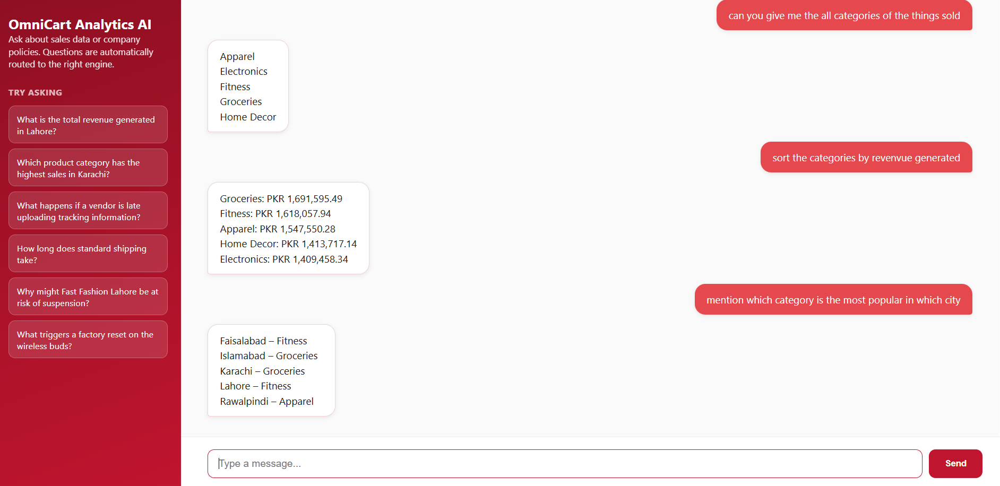

# OmniCart Analytics AI

**Enterprise Big Data & RAG Intelligence Engine**: a hybrid AI assistant that unifies structured retail transaction data with unstructured corporate policy documents, queryable through natural language.

## Screenshot



## Update Log

**Latest update:**
- Replaced the Gradio interface with a custom **Flask dashboard** (sidebar layout with branding + clickable example questions, clean chat thread, fixed input bar), exposed via an ngrok tunnel for public access from Colab
- Migrated from the deprecated `llama-3.3-70b-versatile` model to **`openai/gpt-oss-120b`** on Groq
- Switched the agent from a text-based ReAct pattern to a **native tool-calling agent** (`create_tool_calling_agent`), using the `@tool` decorator for clean schema generation. This resolves iteration-limit failures and tool-schema validation errors that came up under the old ReAct + generic `Tool(func=...)` pattern
- Added consistent **PKR currency formatting** and stripped stray markdown (bold asterisks) from agent responses for a cleaner chat UI

## Overview

Traditional retail analytics setups isolate operational databases (sales, transactions, vendor performance) from unstructured knowledge (policy manuals, FAQs, vendor agreements). OmniCart Analytics AI bridges that gap with a dual-engine architecture:

- A **Structured Engine** (Apache Spark SQL) for querying transactional and vendor performance data
- An **Unstructured Engine** (Qdrant vector store + RAG) for querying corporate policies and FAQs
- A **LangChain tool-calling agent** (powered by Groq's `openai/gpt-oss-120b`) that automatically routes each question to the correct engine, or combines both when a question needs numeric data *and* policy context together

## Architecture

```
                    User Query (Flask Chat Dashboard)
                                │
                                ▼
                LangChain Tool-Calling Agent (Groq LLM)
                       /                    \
                      ▼                      ▼
         Spark SQL Query Tool        Policy Search Tool (RAG)
         ┌──────────────────┐        ┌──────────────────────┐
         │ sales_records     │        │ Qdrant in-memory      │
         │ vendor_performance│        │ vector store           │
         │ (Spark SQL views) │        │ (policy/FAQ chunks)    │
         └──────────────────┘        └──────────────────────┘
```

### Structured Engine
- **`sales_records`**: 5,000 synthetic e-commerce transactions across 5 Pakistani cities, 5 product categories
- **`vendor_performance`**: 10 vendors with order defect rates and tracking upload delays, used to demonstrate policy-rule violations (e.g. ODR > 1.5%)
- Registered as Spark SQL temporary views (`createOrReplaceTempView`), queried live by the agent via generated SQL

### Unstructured Engine (RAG)
- Corporate policy documents (shipping guidelines, product FAQs, vendor agreements) are chunked in **parallel using a PySpark Pandas UDF** wrapping LangChain's `RecursiveCharacterTextSplitter`
- Chunks are embedded using `sentence-transformers/all-mpnet-base-v2` (fully local, no API key required)
- Indexed into an **in-memory Qdrant vector store** for fast semantic similarity search

### Orchestration Layer
- A LangChain **tool-calling agent** decides which tool(s) to call based on the question, executes them, and synthesizes a final answer
- Tools are defined with the `@tool` decorator for reliable schema generation under native tool-calling
- Powered by **Groq's free-tier API** running `openai/gpt-oss-120b` for fast, low-cost inference

### Interface
- A custom **Flask chat dashboard** with a branded sidebar, clickable example questions, and a clean chat thread, deployed via an ngrok tunnel for a public link directly from Colab

## Tech Stack

| Component | Technology |
|---|---|
| Language | Python 3.10+ |
| Big Data Framework | Apache Spark (PySpark SQL) |
| LLM Orchestration | LangChain (Tool-Calling Agent) |
| Vector Database | Qdrant (in-memory mode) |
| Embeddings | HuggingFace `sentence-transformers/all-mpnet-base-v2` |
| LLM Inference | Groq API (`openai/gpt-oss-120b`) |
| Interface | Flask + ngrok |
| Environment | Google Colab |

## Example Queries

| Question | Engine Used |
|---|---|
| "What is the total revenue generated in Lahore?" | Structured (Spark SQL) |
| "How long does standard shipping take?" | Unstructured (RAG) |
| "Why might Fast Fashion Lahore be at risk of suspension?" | Both: pulls defect rate from Spark SQL and the ODR policy rule from RAG |

## Running This Project

This project is designed to run entirely in **Google Colab**, completely free: no paid API keys, no cloud infrastructure, no local storage requirements.

1. Open `OmniCart_Analytics_AI.ipynb` in Google Colab
2. Get a free Groq API key at [console.groq.com](https://console.groq.com) → API Keys → Create API Key
3. Get a free ngrok authtoken at [dashboard.ngrok.com](https://dashboard.ngrok.com) → copy your Authtoken
4. In Colab, add both as secrets: Secrets panel → Add new secret → name them `Groq_API_Keys` and `NGROK_AUTH_TOKEN` → paste your values → enable notebook access for each
5. Run all cells in order (Cell 1 → 1b → 2 → 3 → 4)
6. Cell 4 launches the Flask dashboard and prints a public ngrok URL

No local dataset downloads are required, all data (transactions, vendor records, policy documents) is synthetically generated inside the notebook so the project is fully self-contained and reproducible.

## Project Structure

```
OmniCart-Analytics-AI/
├── OmniCart_Analytics_AI.ipynb   # Main notebook (all cells)
├── requirements.txt               # Python dependencies
├── README.md                      # This file
├── app_screenshot_1.PNG           # Dashboard screenshot
├── dashboard_screenshot.PNG       # Old Dashboard screenshot
└── .gitignore
```

## Notes

- All data (transactions, vendor performance, policy documents) is **synthetically generated**: no external dataset dependency, no training required
- No models are trained from scratch; this project uses pre-trained embeddings + LLM inference with retrieval and tool-calling
- The Qdrant vector store runs in `:memory:` mode, so it resets each time the notebook restarts. This is intentional for a free, zero-infrastructure demo
- The Flask dashboard runs on a Colab-bound ngrok tunnel; the public link stays active only while the Colab session is running (Colab free-tier sessions disconnect after roughly 90 minutes of inactivity or a 12-hour hard cap)
